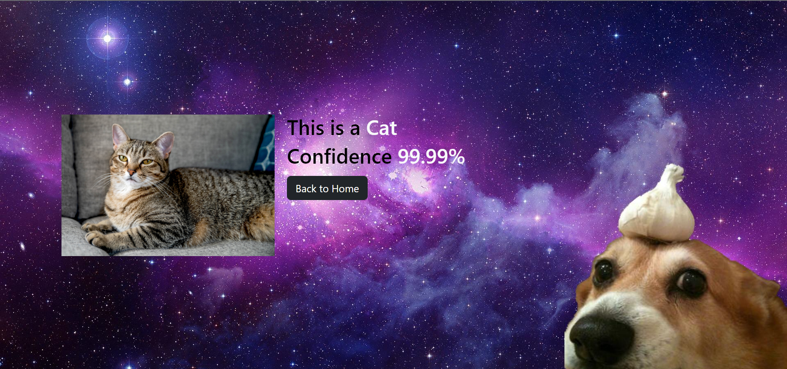

# Animal Classification 

This project includes a Keras model for classifying three types of animals (birds, cats, and dogs), 
and a Flask web application for visualizing the results by uploading an image of the animal to be identified.

### Installation:

Python 3 must be installed

```shell
git clone https://github.com/arsenmakovei/animal-classification.git
cd animal-classification
python3 -m venv venv
source venv/bin/activate (on macOS)
venv\Scripts\activate (on Windows)
pip install -r requirements.txt
flask run
```

[Google Colab Link](https://colab.research.google.com/drive/1jncvqVbfeuAK6A-0KZxc4U-Ia3MWrHgX?usp=sharing)

### Demo:

Home page


Result page
